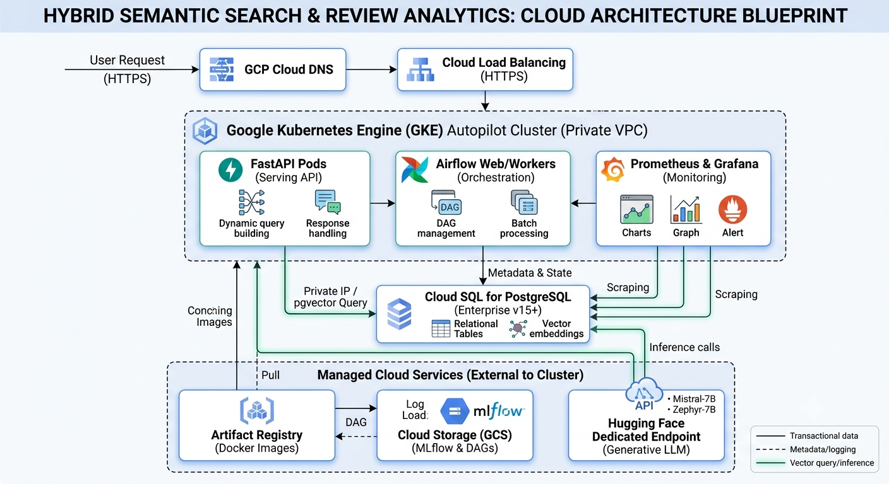

# semantic-product-search



```
semantic-product-search/
│
├── .github/
│ ├── workflows/               # CI/CD pipelines (Linting, Docker build)
| │ ├── ci.yml
│ | └── deployment.yml
│
├── amazon-data/               # Dataset
│ ├── Gift_cards.jsonl         # Application parameters
│ └── meta_Gift_cards.jsonl
|
├── config/                    # Configuration management
│ ├── config.yaml              # Application parameters
│ ├── logging.conf             # Standardized logger configurations
│ └── read_configs.py
│
├── db/                        # SQL Schema and Migration Control
│ ├── alembic/                 # Alembic migration environment
│ │   └── versions/            # Database migration tracks
│ ├── tables/                  # SQLAlchemy classes with pgvector/halfvec types
│ | ├── base.py
│ | ├── product_embeddings.py
| │ ├── products.py
│ │ └── reviews.py
│ ├── alembic.ini              # Alembic configuration
│ ├── consts.py
│ ├── seed_data.py             # Populates local instance for testing
│ └── seed_helpers.py
│
├── dags/                      # Apache Airflow Workflows
│ ├── src/                     # Helper modules for ETL tasks
│ │ ├── helpers.py
│ │ ├── embedder.py            # Generates vectors & manages precision scaling
│ │ └── transformer.py         # Text cleaning and preprocessing
│ ├── tasks/
│ │ ├── alchemy_helpers.py
│ │ ├── consts.py
│ │ ├── embeddings.py
│ │ ├── extraction.py
│ │ ├── load.py
│ │ └── transformation.py
│ └── product_ingestion_dag.py # Main orchestration file
│
├── deploy/                    # Added: Production Deployment Architecture
│ ├── terraform/               # Cloud Provisioning (IaC)
│ │ ├── main.tf                # Provisions Cloud SQL, GKE, GCS, and Networking
│ │ ├── variables.tf           # Parameter inputs (Region, DB instances)
│ │ └── outputs.tf
│ └── kubernetes/              # Runtime Application Configurations
│  ├── fastapi-deployment.yaml # Declares Pod scaling, environments, readiness probes
│  ├── fastapi-service.yaml    # Internal cluster routing
│  └── ingress.yaml            # Configures Cloud Load Balancer routing
│
├── docker/
│ ├── grafana/
│ │ ├── provisioning/
│ │ │ ├── dashboards/
│ │ │ │ └── dashboards.yml
│ │ │ └── datasources/
│ │ │ │ └── prometheus.yml
│ ├── postgres/
│ │ └── init.sql
│ └── prometheus/
│   └── prometheus.yml
│
├── monitoring/                # Added: Observability as Code
│ ├── grafana/
│ │ └── dashboards/
│ │  ├── system_perf.json      # Dashboard config for FastAPI & DB latencies
│ │  └── llm_metrics.json      # Dashboard config for token usage and costs
│ └── alerting_rules.yml       # Added: Slack/Email alert rules for high latency
│
├── src/                       # Backend FastAPI Core Engine
│ ├── api/                     # Route endpoints
│ │ ├── v1/
│ │ │ ├── helpers.py
│ │ │ ├── products.py          # CRUD and metrics routes
│ │ │ └── pydantic_classes.py
│ │ │ └── search.py            # Main dynamic search (Binary Scan -> Scalar Re-rank)
│ │ └── deps.py                # API Dependencies (Database sessions, HF clients)
│ ├── services/                # Business logic layers
│ │ ├── clients/
│ │ │ ├── embedding_client.py
│ │ │ └── generator_client.py
│ │ ├── tracking/
│ │ │ ├── per_request.py
│ │ │ └── rolling.py
│ │ ├── hf_client.py            # Interfacing with Hugging Face models
│ │ ├── ml_tracking.py          # Tracks Quantization parameters, latency metrics, prompt variants
│ │ └── telemetry.py            # Tracks Quantization parameters,latency metrics, prompt
│ └── main.py                   # FastAPI ASGI Application entry point
│
├── tests/                      # Unit and Integration test vectors
│ ├── conftest.py               # Fixtures (mock DB, mock HF endpoints)
│ ├── test_api.py               # Validates varying column outputs and structural performance
│ └── test_pipeline.py          # DAG operator component validation
│
├── docker-compose.yml          # Local stack setup (Airflow, MLflow Server, Postgres)
├── Dockerfile                  # Multi-stage production container build
├── README.md                   # Comprehensive portfolio documentation
├── requirements.txt            # Python dependency manifests
└── Schema.sql
```

Steps:

```
1. brew install postgresql@16
2. brew services start postgresql@16
3. echo 'export PATH="/opt/homebrew/opt/postgresql@16/bin:$PATH"' >> ~/.zshrc
4. source ~/.zshrc
```

@article{hou2024bridging,
title={Bridging Language and Items for Retrieval and Recommendation},
author={Hou, Yupeng and Li, Jiacheng and He, Zhankui and Yan, An and Chen, Xiusi and McAuley, Julian},
journal={arXiv preprint arXiv:2403.03952},
year={2024}
}
